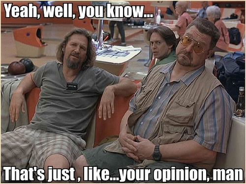

# 🎨 Formatting

Uncle Bob likes his code clean and his ____ dirty. (fill in the blank)

"...a scrambled mass of code that looks like it was written by a bevy of drunken sailors.."



These are just code formatting opinions, and I won't die on a hill for any of them.

## The Purpose of Formatting

The purpose is readability. Readability affects maintainability and extensibility

## Vertical Formatting

Smaller files are usually easier to understand than a large files. Shoot for 200-500 lines max.

### The Newspaper Metaphor

Code files should be read from the top down. 
File names should be simple but explanatory.
The names (plus directory structure) should let us know if we are in the right module.

### Vertical Openness Between Concepts

Group of lines represent a complete thought.
Use blank lines separating functions, imports, package declarations, etc.

### Vertical Density

Lines of code that are tightly related should appear vertically dense.
Avoid extra useless space (and comments).

### Vertical Distance

Concepts in your code that are related to each other should be relatively close.
Vertical separation can be a measure of how important concept are to each other.

#### Variable Declaration

Variable declarations should be as close as possible to where they are used.

#### Instance variables

Declare instances variables at the top of the class.

#### Dependent Functions

If one function calls another, they should be close.
The caller should be above the callee.

#### Conceptual Affinity

The stronger the affinity, the less vertical space.

### Vertical Ordering

Function call dependencies point in a downward direction.

## Horizontal Formatting

Keep your lines short. Keep them to a max of length of 100 to 120 characters. Your should never have to scroll to the right.

### Horizontal Openness and Density

Horizontal white space can be used for associating things that strongly related.

With assignment statement, have a space between the left side and the right side.

```php
// Bad
$array=[1,2,3,4];

// Better
$array = [4,5,6,7];

// Better??
$array = [8, 9, 10, 11];
```

Since functions and arguments are closely, there are no spaces between the function name and opening parenthesis.
But use a space between arguments to show they are different.

```php
// Good
public static double root1(double a, double b, double c) {
    double determinant = determinant (a, b, c);
    return (-b + Math.sqrt(determinant)) / (2*a);
}
```

### Horizontal Alignment

Horizontal alignment is not too useful, avoid it if you can.

### Indentation

Indentation establishes hierarchy in your code.

```php
// Bad
<?php
declare(strict_types=1);
namespace App\Models;
class User{
private string $name;private string $email;
public function __construct(string $name,string $email){$this->name=$name;$this->email=$email;}
public function getName():string{return $this->name;}
public function getEmail():string{return $this->email;}
public function setName(string $name):void{$this->name=$name;}
public function setEmail(string $email):void{$this->email=$email;}
}
```

```php
// Good
<?php

declare(strict_types=1);

namespace App\Models;

class User
{
    private string $name;
    private string $email;

    public function __construct(string $name, string $email)
    {
        $this->name  = $name;
        $this->email = $email;
    }

    public function getName(): string
    {
        return $this->name;
    }

    public function getEmail(): string
    {
        return $this->email;
    }

    public function setName(string $name): void
    {
        $this->name = $name;
    }

    public function setEmail(string $email): void
    {
        $this->email = $email;
    }
}
```

#### Breaking Indentation

You may be tempted to not indent with short if statements, while loops, or functions. Don't do it. Just don't.

```javascript
// Bad
const fetchThing = () => { return thing; }
```

```javascript
// Better
const fetchThing = () => {
    return thing;
}
```

### Dummy Scopes

Try to avoid these if possible...

## Team Rules

Keep it consistent. I don't care if you put an 🍆 at the end of each line, as long as it's consistent.
Automate is as much as possible. Pick tools that best suite your needs for you language and build them into your workflow.

## But What About Markup?

But Uncle Bob, you didn't talk about formating markup (HTML, XML, Markdown, etc). Keep it simple, endent nested elements into others.

```html
<div>
    <section>
        <div>
            <h2>This is a Heading</h2>
            <div>This is a description of a thing. Use your imagination</div>
        </div>
    </section>
    <section>
        <h2>The next section</h2>  
    </section>
</div>
```

## Formatting vs Linting

Formatting ensures code looks clean and follows consistent style rules, and linting checks code for errors and potential bugs.

### Formatting

Formatting is about how your code looks. It's focus is on the style, not the correctness.

Formatting should:

- Fix indentation
- Adds/removes spaces or line breaks
- Order imports
- Enforces consistent styling

Formatting tools:

- PHP: PHP-CS-Fixer ([PSR-12](https://www.php-fig.org/psr/psr-12/)), Prettier (with PHP plugin)
- JavaScript: Prettier

Note: Prettier is a formatter that supports these file types out of the box:

- HTML
- CSS, Less, and SCSS
- JavaScript
- TypeScript
- JSON
- YAML
- Markdown and MDX
- JSX
- Angular
- Vue
- GraphQL
- Flow
- Ember/Handlebars


### Linting

Linting is about finding problems in your code. Both syntactic (missing brackets, etc.) and semantics (unused variables, deprecated functions, etc.).

Linting should:

- Detect errors, warnings, or code smells
- Enforces coding standards or best practices
- Helps prevent bugs and maintain code quality.

Linting tools:

- PHP: php -l, PHPStan
- JavaScript: ESLint

